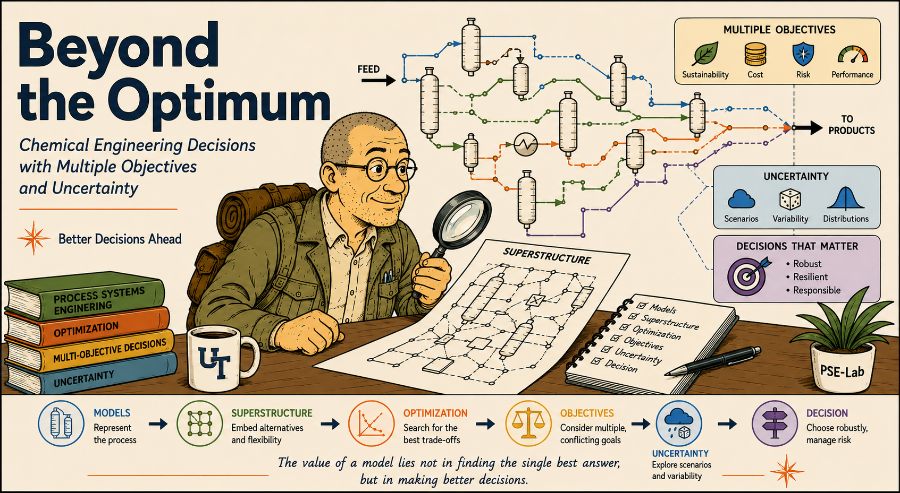
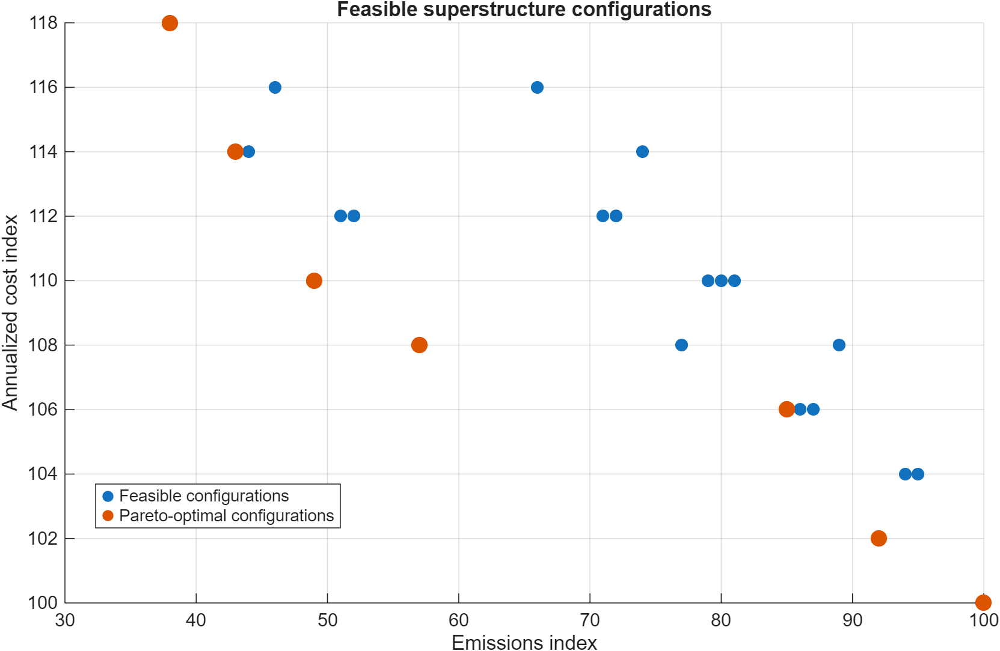
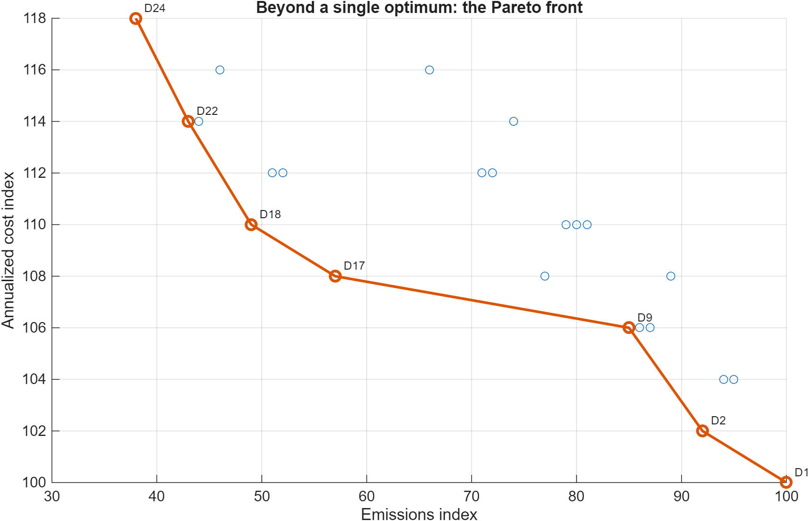
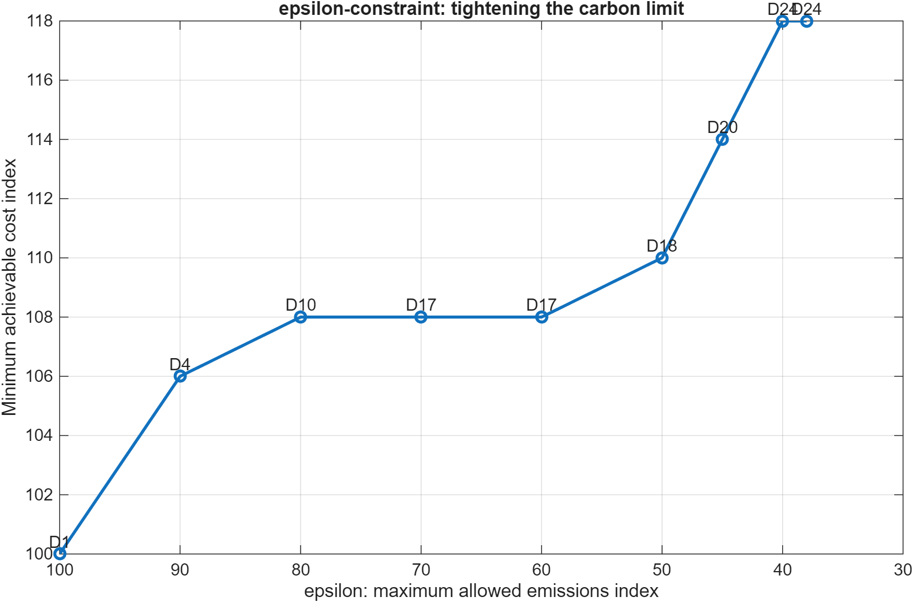
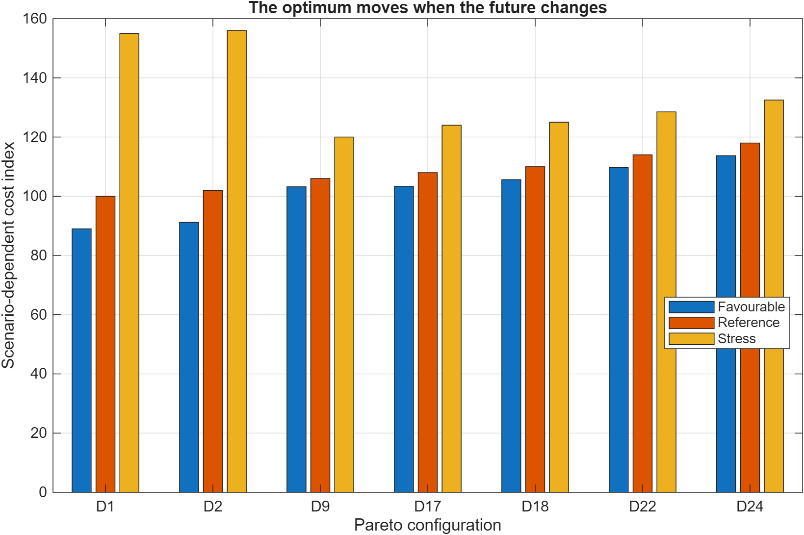
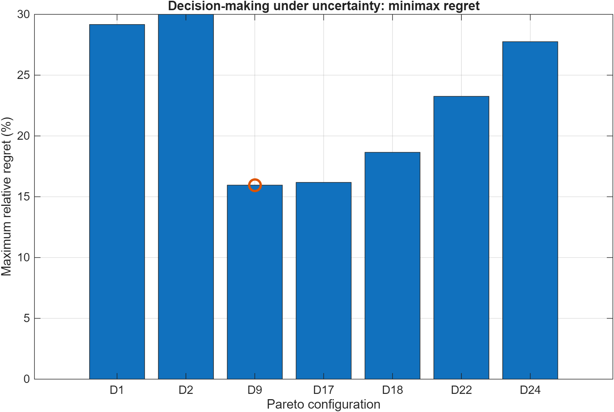

# Beyond the Optimum

## Chemical Engineering Decisions with Multiple Objectives and Uncertainty



This repository contains the MATLAB teaching example developed for the keynote at ARAMCO (October 2026):

**Beyond the Optimum: Chemical Engineering Decisions with Multiple Objectives and Uncertainty**

The example uses a deliberately simplified low-carbon methanol superstructure to connect several core ideas in Process Systems Engineering:

* superstructure-based process design
* mathematical programming
* multi-objective optimization
* Pareto analysis
* epsilon-constraint optimization
* decision-making under uncertainty
* minimax-regret analysis

The central idea is simple:

> **The optimum is an answer to a mathematical question. Engineering requires a decision.**

---

## From process alternatives to engineering decisions

The example follows one process-design problem through a sequence of increasingly realistic questions:

**What could we build?**
→ superstructure

**Which configurations perform best?**
→ mathematical programming

**Best according to what?**
→ multiple objectives

**What happens when the future changes?**
→ uncertainty

**Which alternative should we actually choose?**
→ engineering decision

This leads to the overall workflow:

**Models → Superstructure → Optimization → Objectives → Uncertainty → Decision**

---

## Teaching superstructure

The simplified methanol superstructure contains five binary technology decisions:

| Variable | Technology decision                  |
| -------- | ------------------------------------ |
| `yH`     | electrolysis instead of purchased H₂ |
| `yR`     | dedicated renewable electricity      |
| `yT`     | two-stage/intercooled reactor        |
| `yS`     | enhanced separation                  |
| `yI`     | heat integration                     |

With five binary variables, the unconstrained design space contains:

**2⁵ = 32 possible configurations**

Engineering logic removes infeasible combinations, leaving:

**24 feasible designs**

The multi-objective analysis subsequently identifies:

**7 Pareto-optimal configurations**

---

## Repository structure

```text
beyond-the-optimum/
│
├── README.md
│
├── matlab/
│   ├── main.m
│   ├── model_data.m
│   ├── enumerate_configurations.m
│   ├── pareto_front.m
│   ├── epsilon_constraint.m
│   ├── uncertainty_analysis.m
│   └── plotting and utility scripts
│
├── figures/
│   ├── 01_all_configurations.png
│   ├── 02_pareto_front.png
│   ├── 03_epsilon_constraint.png
│   ├── 04_scenario_costs.png
│   └── 05_maximum_regret.png
│
└── docs/
    └── Beyond_the_Optimum_Technical_Companion_v2.docx
```

---

## Running the MATLAB example

Open MATLAB and navigate to the `matlab` directory.

Run:

```matlab
main
```

The script:

1. generates the feasible superstructure configurations;
2. identifies the Pareto-optimal designs;
3. performs the epsilon-constraint analysis;
4. evaluates the designs under several uncertainty scenarios;
5. calculates maximum regret;
6. generates the figures used in the keynote.

The generated figures are written to the repository-level `figures` directory.

---

## Example outputs

### Feasible design space



### Pareto front



### Epsilon-constraint analysis



### Scenario analysis



### Minimax regret



---

## Mathematical idea

The topology decisions are represented by binary variables:

$$
\mathbf{y} =
[y_H,y_R,y_T,y_S,y_I]^T
$$

with:

$$
y_i \in \{0,1\}
$$

A simple engineering-logic constraint is:

$$
y_R \leq y_H
$$

which states that renewable electricity can only be selected when electrolysis is present.

The multi-objective problem can be written conceptually as:

$$
\min_{\mathbf{x},\mathbf{y}}
\left(
C(\mathbf{x},\mathbf{y}),
E(\mathbf{x},\mathbf{y})
\right)
$$

where `C` represents annualized cost and `E` represents emissions.

The epsilon-constraint formulation becomes:

$$
\min C(\mathbf{x},\mathbf{y})
$$

subject to:

$$
E(\mathbf{x},\mathbf{y}) \leq \varepsilon
$$

---

## Important model disclaimer

The numerical cost and emissions values are **normalized teaching indices**.

The model is intended to demonstrate the structure of engineering decision-making and optimization. It is **not** a validated techno-economic model of an industrial methanol plant and does not contain proprietary or Saudi Aramco process data.

---

## Technical companion

A more detailed description of the superstructure, mathematical formulation, Pareto analysis, uncertainty treatment, regret calculation and MATLAB implementation is available in:

`docs/Beyond_the_Optimum_Technical_Companion_v2.docx`

---

## Workshop context

This example was developed for the **Advanced Process Modeling Workshop 2026**, organized by Saudi Aramco.

The broader workshop theme concerns hybrid modeling, advanced process modeling and machine learning in reactor and process technology development.

Within that context, this example emphasizes the connection:

**better models → better exploration of alternatives → better engineering decisions**

---

## Author

**Edwin Zondervan**
University of Twente
Process Systems Engineering

---

## Final thought

> **Models predict. Optimization explores. Engineers decide.**
